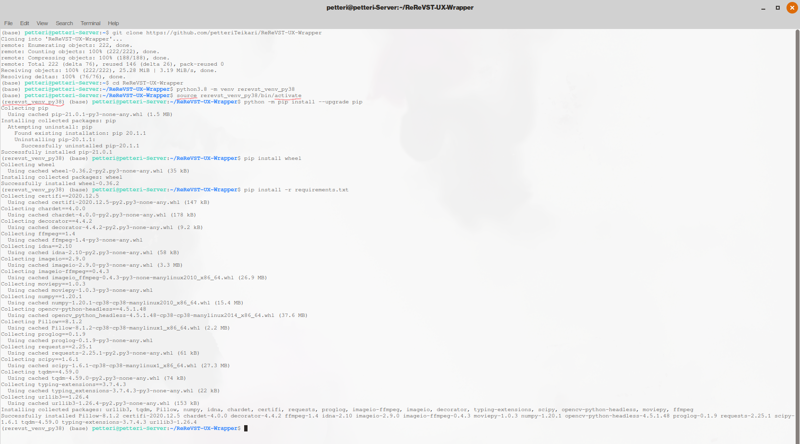
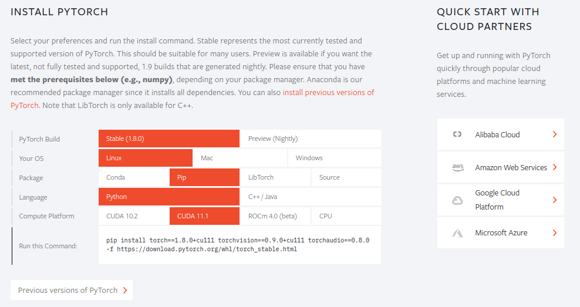
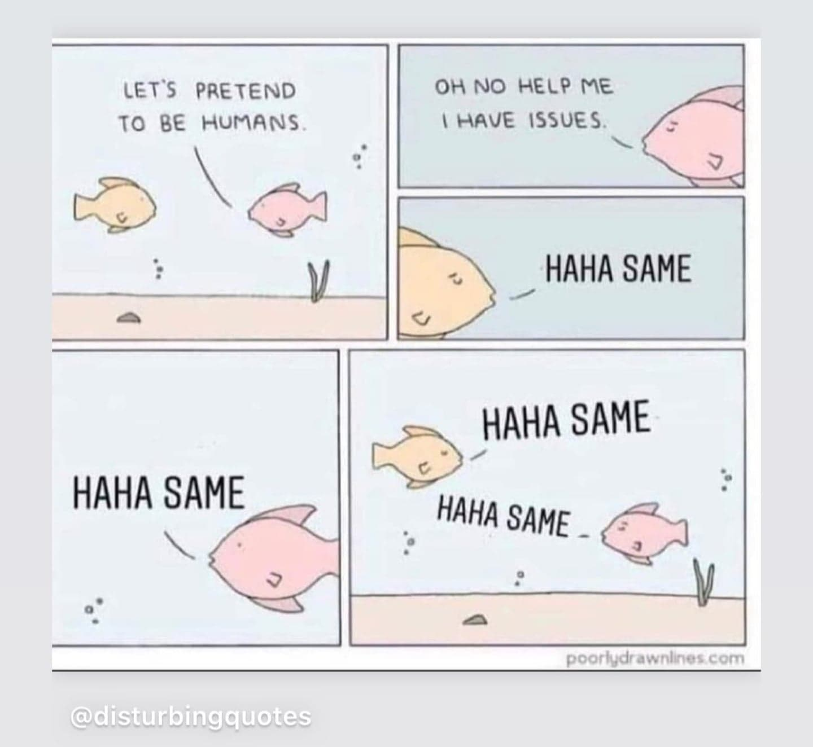

# Usability wrapper for ReReVST

This is an "UX wrapper" to make video style transfer a bit easier to do on your videos if you are not a ML engineer/scientist, and the instructions are really detailed because of that. If you are more into artistic / creative uses of video style transfer, and do not know much of code.

Original project from

Wenjing Wang, Shuai Yang, Jizheng Xu, and Jiaying Liu. **"Consistent Video Style Transfer via Relaxation and Regularization"**, _IEEE Trans. on Image Processing (TIP)_, 2020. https://doi.org/10.1109/TIP.2020.3024018 (see [citing papers on Scholar Google](https://scholar.google.co.uk/scholar?cites=4735550302416573229&as_sdt=2005&sciodt=0,5&hl=en))

Project Website: https://daooshee.github.io/ReReVST/ - https://github.com/daooshee/ReReVST-Code


The publication tries to address the issue of "old school" frame-based style transfer techniques that do not take into account the whole video in analysis, which in practice causes annoying "flickering" between successive frames (which might also be appealing visually to some people, up to you)


_illustrated e.g. by [Characterizing and Improving Stability in Neural Style Transfer
](https://arxiv.org/abs/1705.02092)_

## Petteri's notes

This repo is a "wrapper repo" basically making the code a bit easier to run, if you for example want to quickly make artistic video style transfer and don't want to wrestle with the code forever. 

* Added **virtual environment** to make the work _a bit more_ reproducible
* Removed the need to do the mp4 -> png conversion as it got a bit annoying. No the inputs are just whatever **video files that `imageio ffmpeg` supports**
* Original repository did not keep **audio** at all, which was annoying if you wanted to stylize videos with audio tracks. This now handled with `MoviePy`
* **TODO!** At the moment the workflow does not handle high-resolution videos automagically as you probably very easily run out of RAM when trying to process high-res videos. The sample video `scatman.mp4` provided with this repo is `256 x 256 px`. If you wanna do HD/4K videos, you probably better just do this with some cloud provider.

### Pre-prerequisites to get this code working on your machine

Everything is easier on Ubuntu (Linux), but you should get this working on Windows with a GPU, and on Mac with a CPU.

1) Install [Anaconda3.8 Linux](https://www.anaconda.com/products/individual/download-success) / [Anaconda3.8 Windows](https://www.anaconda.com/products/individual) (This is a Python "By data scientists, for data scientists" in practice, if you are familiar with Python, and have already installed Python from other source, this repo might work as well)

* **Note!** If you are on Windows, the path variable will not be added automatically like on Ubuntu, and you get this famous [`“python” not recognized as a command`](https://stackoverflow.com/questions/7054424/python-not-recognized-as-a-command), so you could for example follow the instructions from [Datacamp](https://www.datacamp.com/community/tutorials/installing-anaconda-windows) on how to add Anaconda to Path (to your environmental variables). See even the [short video on this](https://youtu.be/mf5u2chPBjY?t=15m45s)

2) Install [Git](https://git-scm.com/book/en/v2/Getting-Started-Installing-Git), if you are `pull`ing this repo (you could just download the zip as well if you really do not know what this is)

3) GO to terminal (Ctrl+Alt+T on Ubuntu) / command window ([Anaconda Prompt](https://problemsolvingwithpython.com/01-Orientation/01.03-Installing-Anaconda-on-Windows/) or [Microsoft Command Prompt](https://www.howtogeek.com/235101/10-ways-to-open-the-command-prompt-in-windows-10/), i.e. the black window from the [DOS times](https://en.wikipedia.org/wiki/DOS) from last millennium that maybe Gen Z have never heard of) here and execute **all the following commands from there**.

As an illustration, this is how your commands look like (white console now on my Linux), _note_ the circles on red, when you have activated your virtual environment, so you are not anymore on the `(base)` which is the "system-level Python", i.e. you would installing all those libraries to your "main Anaconda" instead of the virtual environment.




### [Clone](https://medium.com/@madebymade/github-for-dummies-96f753f96a59) this repository

Clone in `git` jargon refers to downloading this to your computer, so you will get this `ReReVST-UX-Wrapper` to your computer to the path that you execute the `git clone` from (e.g. if you are on `(base) C:\Users\UserCreative\`, this repo will be cloned to `C:\Users\UserCreative\ReReVST-UX-Wrapper`)

```bash
git clone https://github.com/petteriTeikari/ReReVST-UX-Wrapper
cd ReReVST-UX-Wrapper
```

### Get the pretrained model

Download `style_net-TIP-final.pth` [~60MB] from the links provided by the authors of the original repo:

Links: [Google Drive](https://drive.google.com/drive/folders/1RSmjqZTon3QdxBUSjZ3siGIOwUc-Ycu8?usp=sharing), [Baidu Pan](https://pan.baidu.com/s/1Td30bukn2nc4zepmSDs1mA) [397w]

And place this `.pth` file to `test/Model` inside your cloned repository `ReReVST-UX-Wrapper`. This is the actual model that stylizes your videos, pretrained by [Wang et al. 2020](https://doi.org/10.1109/TIP.2020.3024018) for you.

### Virtual environment (on which you run the code)

If you do not know what this, you could check for example [Python Virtual Environments: A Primer
](https://realpython.com/python-virtual-environments-a-primer/) or [What Virtual Environments Are Good For
](https://realpython.com/lessons/what-virtual-environments-are-good-for/). In practice, these are used so that you can easily make other people's code work on your own machine without hours of battling with compatible libraries.

#### GPU (assuming you have NVIDIA's GPU and it is okay with [CUDA 11.1](https://developer.nvidia.com/cuda-11.1.0-download-archive))

Create the virtual environment, so this you need to only once. (don't proceed from here if you get the `“python” not recognized as a command` error, this means that your Anaconda Python is not found from "The Path", and you need to add it there, see some solutions [https://stackoverflow.com/questions/49616399/windows-anaconda-python-is-not-recognized-as-an-internal-or-external-command/55347012#55347012](Windows: Anaconda 'python' is not recognized as an internal or external command on CMD))

```
python3.8 -m venv rerevst_venv_py38
```

Activate now the virtual environment (so if you for example power off your laptop, and you want to work again with this virtual environment and on this video style transfer, remember to always activate this specific virtual environment)

```
source rerevst_venv_py38/bin/activate
```

`Pip` is an "automatic installer", so it downloads you the libraries to be installs, and install them without any browser "Save As" and double-clicking, and we first just upgrade `pip` so that it is on its latest version.

```
python -m pip install --upgrade pip
```

Another "low-level" tool, so you can install libraries with [`Wheel`](https://pypi.org/project/wheel/), i.e. from .whl files that you sometimes might see in your installation instructions

```
pip install wheel
```

`requirements.txt` is prvided by the person/team who has written the code for you, so it contains a list of the exact library versions that you need to make this code repository to work. If you would just install the latest packages, you might not get this to work (especially if this repository was very old). Using `requirements.txt` ensures that you have exactly the same versions as me (Petteri) when debugging this and trying to make it work. If you improvise with your own versions (either library or Python version), you might not get this to work (and end up wasting your time and get frustrated)

```
pip install -r requirements.txt
```

#### PyTorch install

Here a ~2 GB Pytorch package is installed, so if your internet is poor (like you live in London), this might take some time (again execute the pip command, it downloads the Pytorch package and installs it for you)

Choose the proper install depending on your operating system (Ubuntu, Windows, Mac OS), and whether you have NVIDIA GPU or not



##### Ubuntu

###### GPU (for CUDA 11.1)

```
pip install torch==1.8.0+cu111 torchvision==0.9.0+cu111 torchaudio==0.8.0 -f https://download.pytorch.org/whl/torch_stable.html
```

###### CPU

```
pip install torch==1.8.0+cpu torchvision==0.9.0+cpu torchaudio==0.8.0 -f https://download.pytorch.org/whl/torch_stable.html
```

##### Windows

###### GPU (for CUDA 11.1)

```
pip install torch==1.8.0+cu111 torchvision==0.9.0+cu111 torchaudio===0.8.0 -f https://download.pytorch.org/whl/torch_stable.html
```

###### CPU

```
pip install torch==1.8.0+cpu torchvision==0.9.0+cpu torchaudio===0.8.0 -f https://download.pytorch.org/whl/torch_stable.html
```

##### MacOS

###### GPU

You need to [install from PyTorch sources](https://github.com/pytorch/pytorch#from-source), if you want to run this on GPU.

###### CPU

```
pip install torch torchvision torchaudio
```

## Using the repository to style your image

In machine learning jargon, you are now "testing" your model (running inference) after you initially trained it with a bunch of examples. If you just to want to quickly style your videos, you do not care about the training part of the code.

`generate_real_video.py` applies style transfer for your input video defined in `--input_video` based on the style in an image `--style_img`.

### Test that you got this repository running on your computer

To test the code with the default values and examples given with this repo, 

```
cd test
python generate_real_video.py --style_img ../inputs/styles/3d_4.jpg --input_video ../inputs/video/scatman.mp4
```

Output video is saved to [`results/video`](https://github.com/petteriTeikari/ReReVST-Code/tree/master/results/video)


### Batch Processing

You probably do not know that well how different style images in the end will be transferred to the video, so you can copy all possible images that you could want to test to a single folder (e.g. `inputs/styles/`), and do something else while you get the results.

You can batch stylize a bunch of videos with a single style:

```
python generate_real_video.py --style_img ../inputs/styles/3d_4.jpg --input_video_dir ../inputs/video/
```

Single video file with multiple styles:

```
python generate_real_video.py --style_img_dir ../inputs/styles/ --input_video ../inputs/video/scatman.mp4
```

Bunch of videos with multiple styles:

```
python generate_real_video.py --style_img_dir ../inputs/styles/ --input_video_dir ../inputs/video/
```


_Single video file, batch processed with 4 different style images_

### Optional settings

Additionally there is an `interval` flag that you can increase to `16`, `32` if you run out of RAM (if you high-res or/and long videos). Depends on your laptop/desktop on how much lifting you can do.

Then, you can find stylized video in `./results/videos/`.

With these optional setting, the inference call would look like:

```
python generate_real_video.py --style_img ../inputs/styles/3d_4.jpg --input_video ../inputs/video/scatman.mp4 --interval 16
```

#### CPU Processing

If you run out of GPU memory, or you have some issues with CUDA, you can force the computations to be done with CPU, makes things a lot slower as well. 

On `i7-7700K CPU @ 4.20GHz` ~1.30 frames are stylized per second compared to ~30 frames per second with [`NVIDIA RTX 2070 Super 8GB`](https://timdettmers.com/2020/09/07/which-gpu-for-deep-learning/), i.e. stylizing a ~9sec video takes 3 min 20 sec on CPU, and around ~9seconds on a GPU. So definitely get a machine with a GPU if you plan to do these a lot :)

```
python generate_real_video.py --style_img ../inputs/styles/huygens_multiphoton_embryo.png --input_video ../inputs/video/scatman.mp4 --force_on_CPU True
```

##### Real-time video style transfer?

So you could even make this work real-time with a proper GPU if you want to do visuals for a VJ set from a live video feed (e.g. [imageio](https://imageio.readthedocs.io/en/stable/examples.html) supports webcam input with the `<video0>` uri). You can downsample a bit the input video feed for higher processing frame rates.

For example [TouchDesigner](https://derivative.ca/) has the [PyTorchTOP](https://github.com/DBraun/PyTorchTOP) library that you could possibly to use this model in your TouchDesigner project? 

Breakdown of the processing times (Model building only need to be done once when starting your VJ set, and then the preparations probably okay from some initial buffering?):

```
Opened style image "3d_4.jpg"
Opened input video "scatman.mp4" for style transfer (fps = 30.0)
Stylization Model built in 0:00:07.734979
Preparations finished in 0:00:03.043060!
Video style transferred in 0:00:08.868579
Prcessing as a whole took 0:00:19.874647
```

### On how to train the model with your custom data

See the original repository https://github.com/daooshee/ReReVST-Code for instructions

### Raising [an issue](https://www.stevejgordon.co.uk/working-on-your-first-github-issue)

This repo released pretty much as it is to make casual video style transfer a bit easier as many of the repos out there were so poorly documented and were tricky to get running



### Tweaking the repository

You probably want to use the created virtual environment in some IDE then, like in [VS Code](https://code.visualstudio.com/docs/python/environments) or [PyCharm](https://www.jetbrains.com/help/pycharm/creating-virtual-environment.html)
